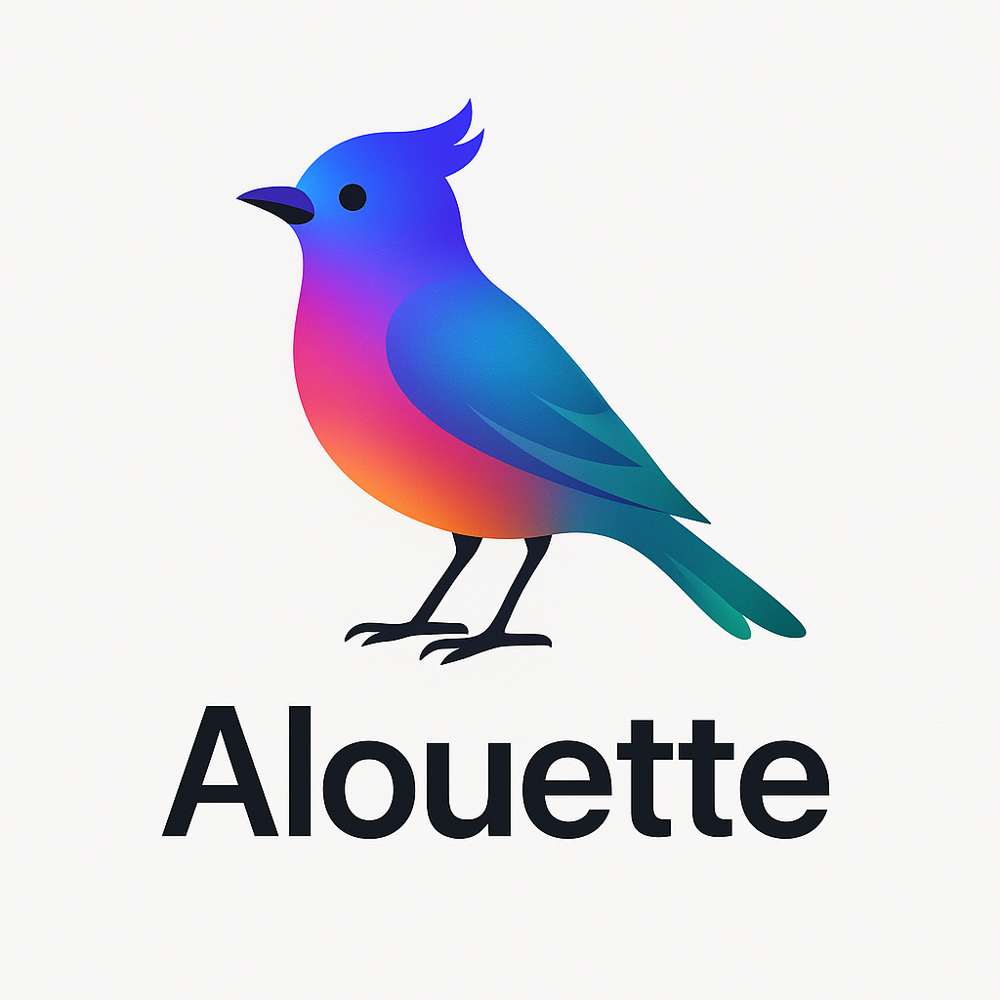

# Alouette TTS

  
  
  **Alouette TTS - Cross-platform Text-to-Speech Application**
  
  *A beautiful, powerful Flutter-based TTS application that supports multiple platforms*
  
  [](https://flutter.dev)
  [](#supported-platforms)
  [](LICENSE)

Alouette TTS is a cross-platform text-to-speech application built with Flutter, supporting multiple languages and voice effect adjustments. It provides an intuitive user interface for users to easily convert text to speech.

## Multi-language Support

1. 🇨🇳 Chinese(`zh-cn`)
2. 🇺🇸 English(`en-us`)
3. 🇩🇪 German(`de-de`)
4. 🇫🇷 French(`fr-fr`)
5. 🇪🇸 Spanish(`es-es`)
6. 🇮🇹 Italian(`it-it`)
7. 🇷🇺 Russian(`ru-ru`)
8. 🇬🇷 Greek(`el-gr`)
9. 🇸🇦 Arabic(`ar-sa`)
10. 🇮🇳 Hindi(`hi-in`)
11. 🇯🇵 Japanese(`ja-jp`)
12. 🇰🇷 Korean(`ko-kr`)

## Supported Platforms

| Platform | Status | Notes |
|----------|--------|-------|
| 🤖 Android | ✅ | API 21+ (Android 5.0+) |
| 🍎 iOS | ✅ | iOS 11.0+ |
| 🌐 Web | ✅ | Chrome, Firefox, Safari |
| 🪟 Windows | ✅ | Windows 7+ |
| 🖥️ macOS | ✅ | macOS 10.14+ |
| 🐧 Linux | ✅ | 64-bit systems |

## Quick Start

### Installation

```bash
git clone https://github.com/feuyeux/alouette-tts.git
cd alouette-tts
```

```bash
flutter pub get
```

### Run the Application

```bash
# Android
flutter run -d android
# iOS
flutter run -d ios
# Web
flutter run -d chrome
# Windows
flutter run -d windows
# macOS
flutter run -d macos
# Linux
flutter run -d linux
```

## Build Release

```bash
./scripts/build_release.sh --all
./scripts/build_release.sh --android-apk --ios
./scripts/build_release.sh --web --macos
./scripts/build_release.sh -c --android-apk
# Windows
scripts\build_release.bat --all
scripts\build_release.bat --android-apk --windows
```

### iOS Build Configuration

```bash
export IOS_DEVELOPMENT_TEAM=YOUR_TEAM_ID
export IOS_BUNDLE_IDENTIFIER=com.yourcompany.app
```

> Team ID：https://developer.apple.com/account#MembershipDetailsCard

### Run Release Builds

```bash
./scripts/run_android.sh
./scripts/run_ios.sh
./scripts/run_web.sh
./scripts/run_macos.sh
./scripts/run_linux.sh
```


```
1. 🇨🇳 Chinese (zh-cn): 你好，我可以为你朗读。
2. 🇺🇸 English (en-us): Hello, I can read for you.
3. 🇩🇪 German (de-de): Hallo, ich kann es für dich vorlesen.
4. 🇫🇷 French (fr-fr): Bonjour, je peux vous lire ce texte.
5. 🇪🇸 Spanish (es-es): Hola, puedo leer esto para ti.
6. 🇮🇹 Italian (it-it): Ciao, posso leggerlo per te.
7. 🇷🇺 Russian (ru-ru): Здравствуйте, я могу прочитать это для вас.
8. 🇬🇷 Greek (el-gr): Γεια σας, μπορώ να το διαβάσω για εσάς.
9. 🇸🇦 Arabic (ar-sa): مرحبًا، أستطيع قراءة هذا لك.
10. 🇮🇳 Hindi (hi-in): नमस्ते, मैं आपके लिए इसे पढ़ कर सुना सकता हूँ.
11. 🇯🇵 Japanese (ja-jp): こんにちは、これを読み上げることができます。
12. 🇰🇷 Korean (ko-kr): 안녕하세요, 제가 읽어 드릴 수 있습니다.
```